# Proyecto_Pydevops 

>En este repositorio se encuentra nuestro proyecto pydevops, que ha sido fruto del trabajo del primer trimeste de _CFGS de Desarrollo Web Dual_.

## Tabla de contenidos

1. [Introducción](#Introducción)
1. [Metodologías](#Metodologías)
1. [Análisis](#Análisis)
1. [Diseño y arquitectura de la aplicación](#diseño-y-arquitectura-de-la-aplicación)
1. [Implementación](#Implementación)
1. [Pruebas](#Pruebas)
1. [Comparación temporal](#Comparación-temporal)
1. [Dificultades](#Dificultades)    
1. [Futuras mejoras](#Futuras-mejoras)
1. [Licencia](#Licencia)

--- 

## Introducción

La premisa principal de este proyecto es desarrollar una aplicación Python que sea capaz de extraer los datos de **MongoAtlas** y, teniendo un esquema de los documentos **JSON**, convertirlos a **Markdown**.
De esa forma **Hugo**, un generador de sitios estáticos, leerá los ficheros Markdown y los convertirá en documentos HTML para su página web.

Así el usuario podrá añadir, actualizar o eliminar un item de la base de datos de forma automática y sin necesidad de acceder al Wordpress.

**[⬆ back to top](#tabla-de-contenidos)**

---

## Metodologías

El marco de trabajo más cercano al procedimiento que se ha seguido en este proyecto vendría siendo la **metodología Scrum** ya que siendo una metodología ágil, tiene como finalidad la entrega de valor en períodos cortos de tiempo, además estamos más familiarizados con ella. 

Se ha contado con un Product Owner y haciendo uso de _sprints_ van respaldadas dos herramientas claves en el nuestro Scrum: _el product backlog_ y _sprint backlog_.

 - El **Product Backlog**, viene siendo las tareas que engloba todo el proyecto, una biblioteca que nos incluye todas las tareas que debemos realizar con el tiempo de desarrollo estimado. Las tareas que están más arriba deben de ser las de mayor prioridad.

- El **Sprint Backlog** es el grupo de tareas del product backlog que el equipo de desarrollo elige en el sprint planning junto con el plan para poder desarrollarlas. 
El sprint planning no cambia durante el sprint, solo cambia el plan para poder desarrollarlas.

Pero, a medida que ha ido avanzando el trabajo, se ha dejado de lado esta para movernos más a la metodología prototipado, ya que se ha ido realizando una mejora individual continuamente en el proyecto.

**[⬆ back to top](#tabla-de-contenidos)**

---

## Análisis

Con el software desarrollado por completo, el usuario, como una de las partes interesadas, podrá añadir, actualizar o eliminar un ítem de la base de datos y solo habrá que lanzar este sistema y la web se actualizará de manera automática con los nuevos ítems.

Una vez acordado el esquema JSON que se aplicará a la BBDD, el tutor tendrá acceso a esa BBDD para poder hacer un CRUD sobre el stock de items.

### Diagrama casos de uso

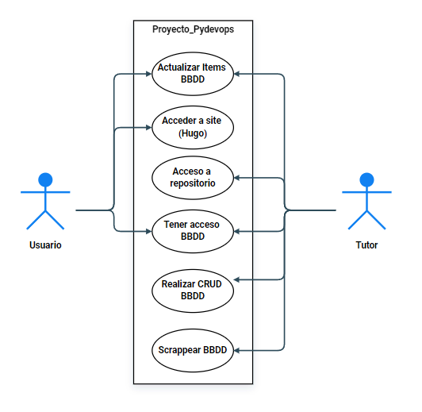

### Tabla

Algunas de las tecnologías que hemos utilizado y sus respectivos requisitos. 

|                    	| VS Code 	| HUGO 	| Google Cloud 	| MongoAtlas 	|
|--------------------	|---------	|------	|--------------	|------------	|
| Markdown           	| X       	|      	|              	|            	|
| Python 3           	| X       	|      	|              	|            	|
| HTML y CSS         	| X       	| X    	|              	|            	|
| BBDD               	|         	|      	|              	| X          	|
| Google Formularios 	|         	|      	| X            	|            	|

**[⬆ back to top](#tabla-de-contenidos)**

--- 

## Diseño y Arquitectura de la aplicación

Teniendo el esquema JSON y el scrapping del tutor en la BBDD, desde Python se convierten esos documentos a Markdown para que Hugo pueda pasarlos a HTML en el Site que genere automáticamente.

El usuario puede introducir los datos que necesite desde el formulario que el Site proporciona, una vez hecho, esos datos podrán generarse en la BBDD.

### Un esquema de lo que recorre la aplicación:

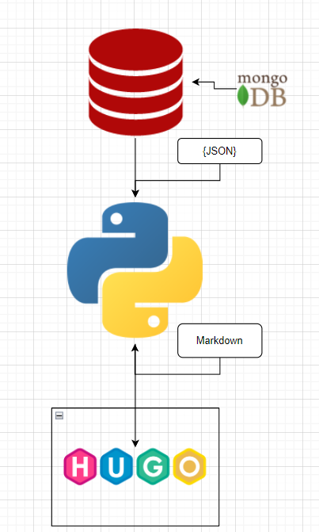

### Diagrama de componentes de este proyecto:

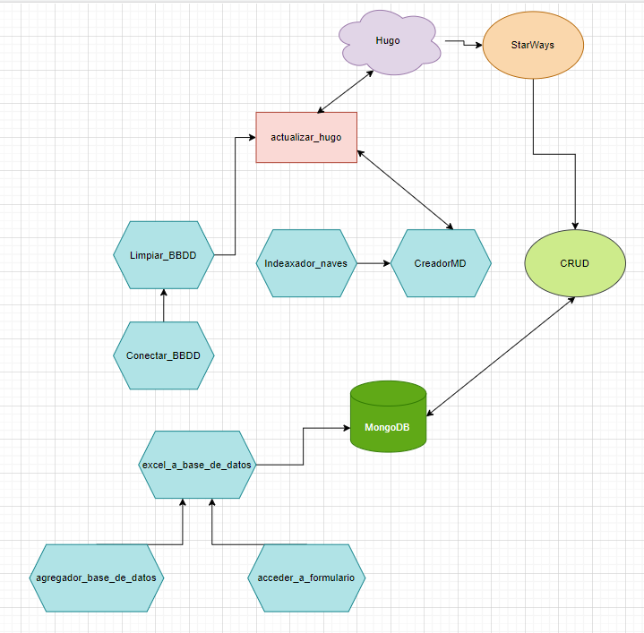

### El esquema que se ha utilizado en la BBDD:

~~~
nave: {
    modelo : string,
    marca : string,
    gama : string,
    tasa: int,                   
    color : string,
    plazas : int,
    características: array
    }
~~~

Una vez que existen unos datos en la BBDD, en este caso, scrappeados por el tutor, se visualiza de la siguiente forma:

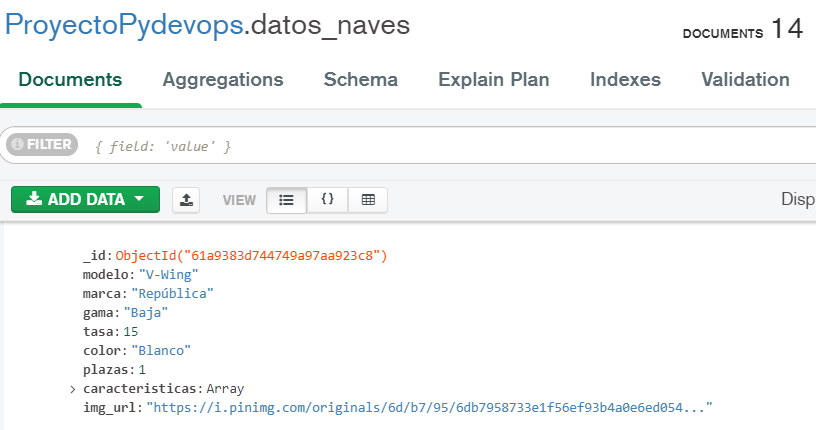

**[⬆ back to top](#tabla-de-contenidos)**

---

## Implementación

El site generado se ha creado usando el framework [Hugo](https://gohugo.io/) y gracias a la ayuda de una de sus plantillas [Hugo Themes Showcase](https://themes.gohugo.io/).

### Tencologías utilizadas

- Python 3
- CSS3
- SCSS
- HTML5
- MongoAtlas
- Markdown 
- Hugo
- os
- Pymongo
- Google excel & formularios
- Google cloud

### BackEnd y FrontEnd

El **[⬆ diagrama comportamientos](#diseño-y-arquitectura-de-la-aplicación)**
es un ejemplo más explícito de como funciona esta aplicacioón.

Una vez tenemos los datos en la BBDD creamos un script que pase esos datos de json a markdwon desde Python, después hay que tener otro script que conecte con esa BBDD, desde equipos Windows puede tener más complicaciones.

Con Hugo instalado y con una plantilla de la página a mano, se asegura que esté en la misma estructura de directorios y se arranca o bien con el comando _Hugo Server_ o bien mediante un script de python. 

Hay que tener un fichero que conecte todos esos ficheros y ejecutarlo, de esta forma se encargará de crear esos markdowns dentro del directorio de Hugo y este pasará a HTML esos markdown. 

En este proyecto ese fichero se llama _actualizar_hugo.py_

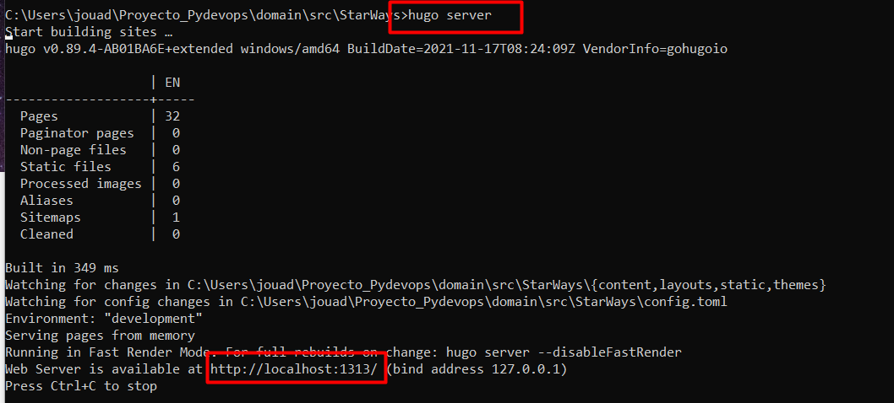

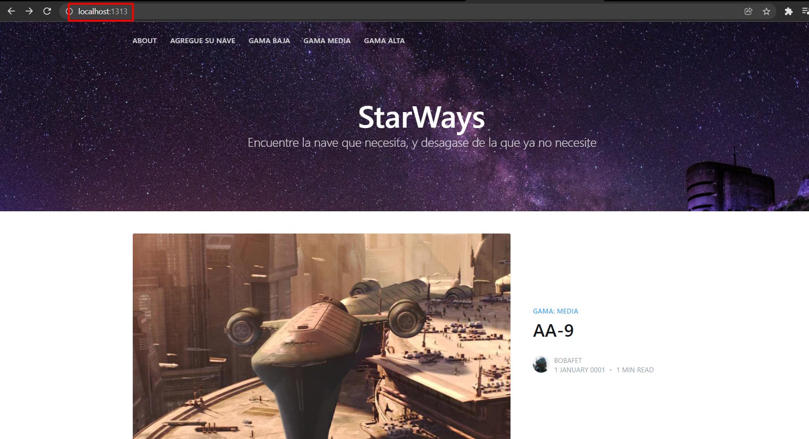

Cuando se visualiza el contenido de la página web se puede comprobar como esos datos que antes eran un json de la BBDD pasan de ser markdown a HTML.

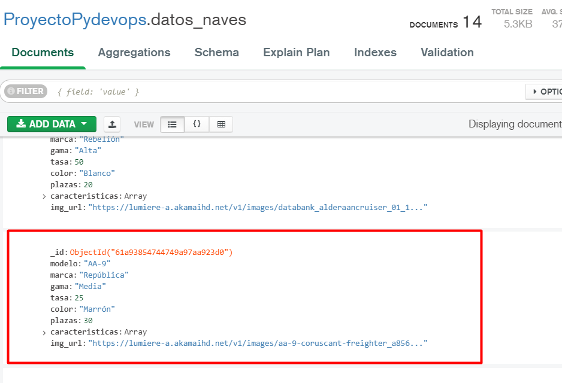

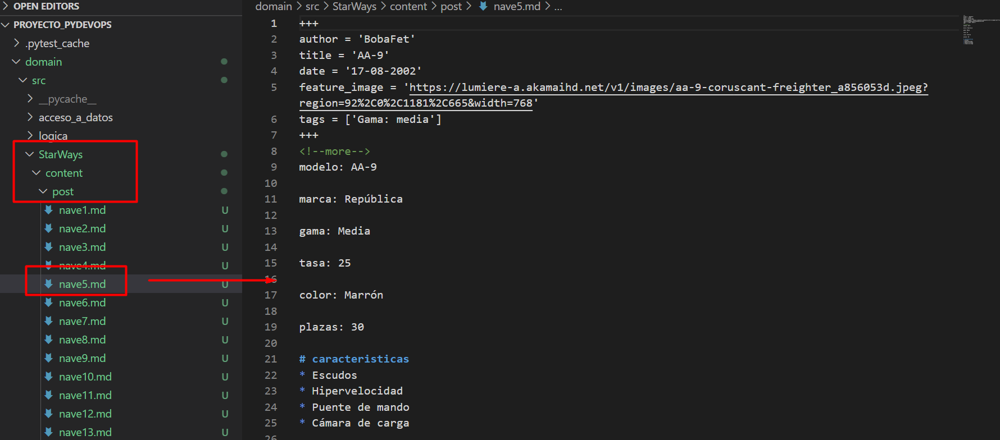

### CRUD

A la hora de implementar el CRUD, las funciones básicas de cualquier base de datos, se ha hecho através de formularios de google y no por consola.

Los pasos son los siguientes:

1. Crear un formulario básico de Google que esté enlanzado a un google excel
2. Tres scripts en Python:
    - Uno para ejecutar el formulario en la página web.
    - Otro para conectarse con la base de datos.
    - Y uno último para el excel.

El usuario podrá introducir unos datos que se visualizarán en el excel y podrán formar parte de la BBDD.

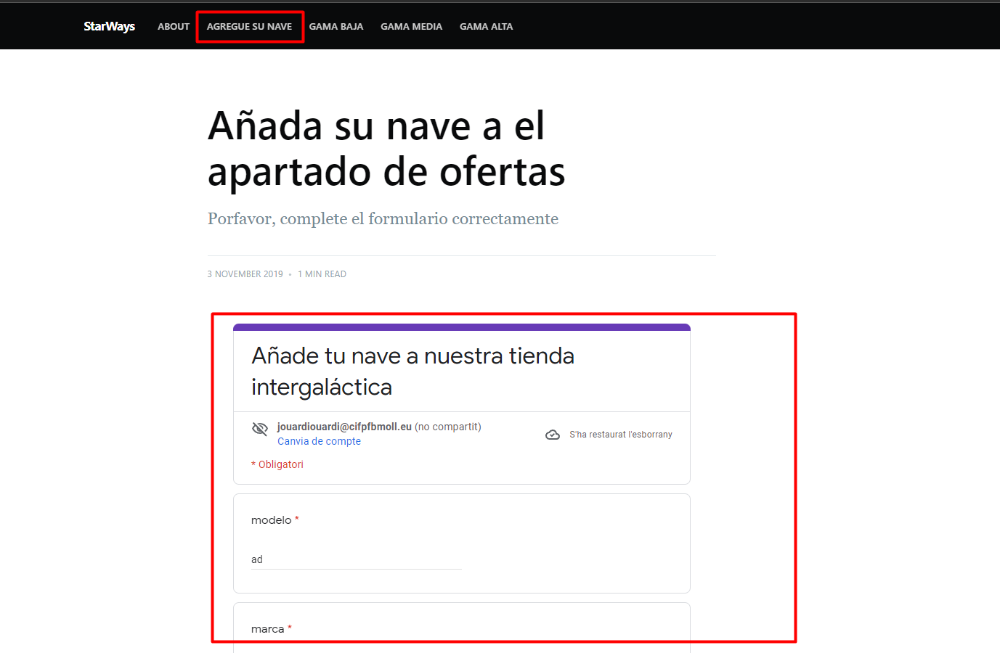

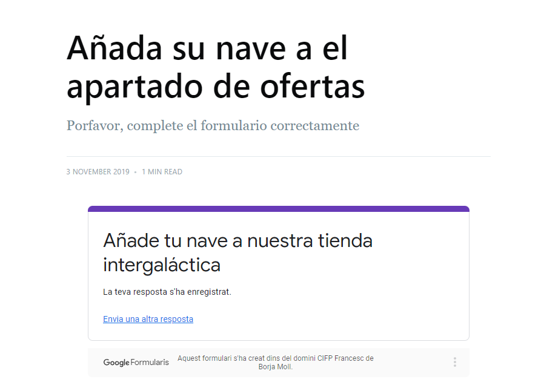

**[⬆ back to top](#tabla-de-contenidos)**

---

## Comparación temporal

- Estimación real (Clockify)

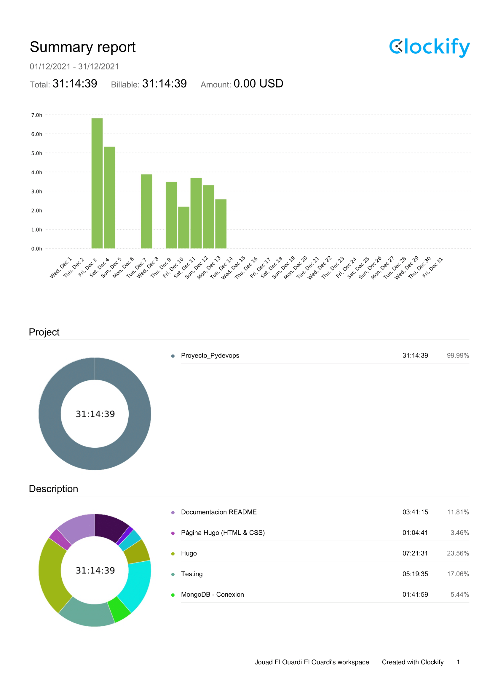

- Estimación por tareas

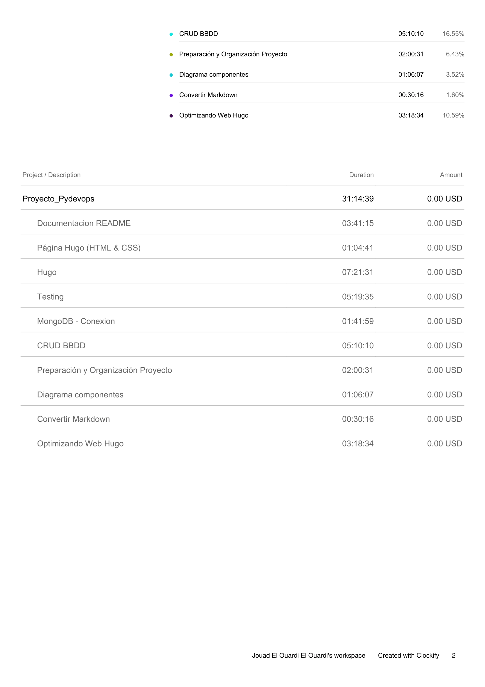

Nota: Faltan 20 horas aproximadamente que se han invertido al inicio del proyecto y no se han
podido añadir al Clockify.

**[⬆ back to top](#tabla-de-contenidos)**

---

## Dificultades

Han habido varios contratiempos y disgustos a la hora de sacar este proyecto adelante, pero para ser breves
es mejor tener etiquetar los puntos claves.

- Hugo, al ser una tecnología nueva, ha llevado varias horas familiarizarse con ella.
- Formularios, nunca se habían usado de esta misma manera a la hora de hacer el CRUD.
- Pequeños fallos de compatibilidad con Windows a la hora de usar diferentes tecnologías.
- Falta de tiempo, es el principal enemigo de este trabajo. Han faltado fácilmente una o dos semanas más para abordarlo de mejor forma.

**[⬆ back to top](#tabla-de-contenidos)**

---

## Futuras mejoras

Algunas de las mejoras que se tienen en cuenta para más adelante son:

- Ejecutar Hugo desde un script.
- Implementar tox con pytest, coverage, black y bandit.

Este apartado puede ir actualizándose con el tiempo.

**[⬆ back to top](#tabla-de-contenidos)**

---

## Licencia

MIT License

Copyright (c) 2021 Jouad El Ouardi & Arturo Garrido

Permission is hereby granted, free of charge, to any person obtaining a copy
of this software and associated documentation files (the "Software"), to deal
in the Software without restriction, including without limitation the rights
to use, copy, modify, merge, publish, distribute, sublicense, and/or sell
copies of the Software, and to permit persons to whom the Software is
furnished to do so, subject to the following conditions:

The above copyright notice and this permission notice shall be included in all
copies or substantial portions of the Software.

THE SOFTWARE IS PROVIDED "AS IS", WITHOUT WARRANTY OF ANY KIND, EXPRESS OR
IMPLIED, INCLUDING BUT NOT LIMITED TO THE WARRANTIES OF MERCHANTABILITY,
FITNESS FOR A PARTICULAR PURPOSE AND NONINFRINGEMENT. IN NO EVENT SHALL THE
AUTHORS OR COPYRIGHT HOLDERS BE LIABLE FOR ANY CLAIM, DAMAGES OR OTHER
LIABILITY, WHETHER IN AN ACTION OF CONTRACT, TORT OR OTHERWISE, ARISING FROM,
OUT OF OR IN CONNECTION WITH THE SOFTWARE OR THE USE OR OTHER DEALINGS IN THE
SOFTWARE.

